# Audit de perfomance et de qualité

# Sommaire
1. [Audit technique](#audit-technique)
    * [Dette technique](#dette-technique)
    * [Analyse automatique](#analyse-automatique)
    * [Review manuelle](#review-manuelle)
2. [Audit de performances](#audit-de-performances)
    * [Analyse des routes](#analyse-des-routes)
3. [Améliorations](#améliorations)
    * [Dockerization](#dockerization)
    * [Implémentation de tests automatisés](#implémentation-de-tests-automatisés)
    * [Ajout de Fixtures pour les tests et le développement](#ajout-de-fixtures-pour-les-tests-et-le-développement)
    * [Ajout agent test coverage](#ajout-agent-test-coverage)
    * [Corrections des anomalies](#corrections-des-anomalies)
    * [Upgrade](#upgrade)
      * [Symfony](#symfony)
      * [PHP](#php)
      * [Dépendances](#dépendances)
      * [Structure des fichiers](#structure-des-fichiers)
    * [Composant de sécurité](#composant-de-sécurité)
    * [Bonnes Pratiques](#bonnes-pratiques)
4. [Gains de performances](#gains-de-performances)

<div style="page-break-after: always;"></div>

# Audit technique
## __Dette technique__
### __Obsolèscence des packages__ <br>
>La commande `composer outdated` nous permet d'afficher la liste des paquets installés ayant des mises à jour disponibles.
>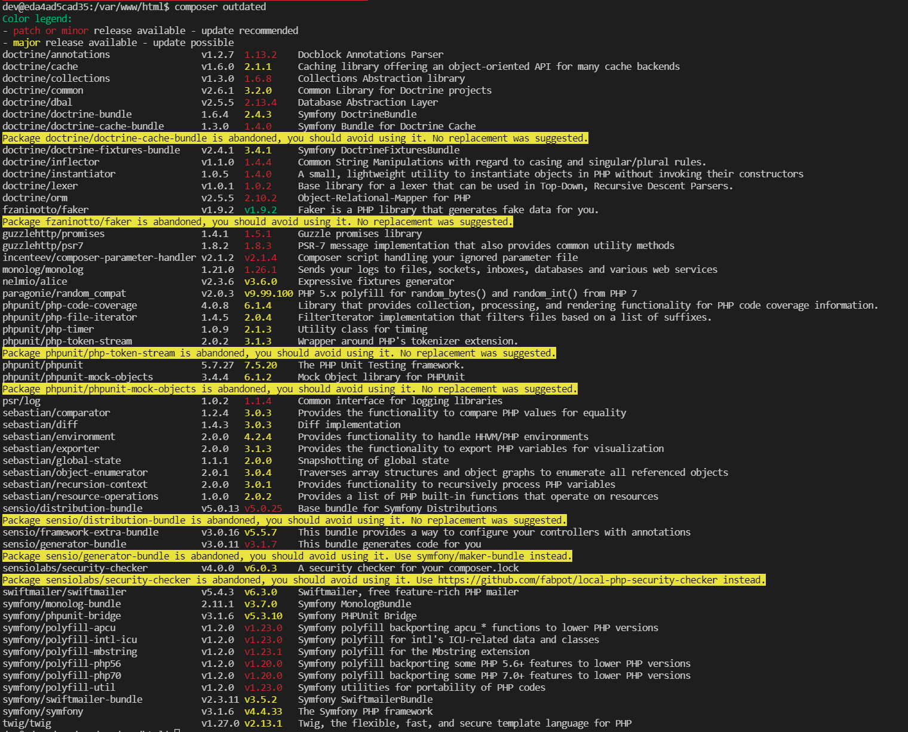

---
### __Version du Framework__<br>
>La version Symfony utilisée est la __3.1__<br>
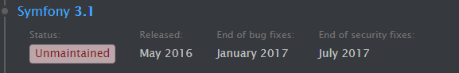 <br>
Comme indiqué dans la documentation cette version est obsolète. <br>
>_source : [calendrier de release Symfony](https://symfony.com/releases)_

---
### __Version php__<br>
>La version haute utilisable est la 7.1.33<br>
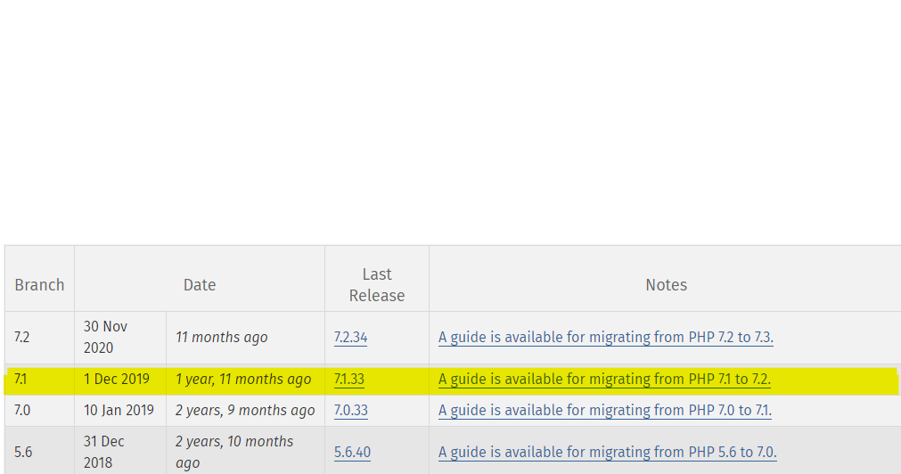<br>
>_source : [doc officielle php](https://www.php.net/eol.php)_

---
## Analyse automatique
>L'analyse de qualité du code faite grace à l'outils [CodeClimate](https://codeclimate.com/) n'a révélé que quelques anomalies non critiques, qui pourront être corrigées facilement.<br>
> 

---
## Review manuelle
### Anomalies
>* Le bouton "Consulter la liste des tâches à faire" renvoie vers la liste de __toutes__ les taches.
>
>* Le bouton "Consulter la liste des taches terminées" ne renvoie nulle part.
>
>* Setter manquant pour l'attribut `isDone` de Task::class
>
>* Fichiers manquant (bootstrap/jquery)
>  Une erreur dans la console signalait des fichiers manquants
>   `web/js/jquery.js`<br>
>   `web/css/bootstrap.min.css.map`


### Points améliorables
>* Ajouter des contraintes de validation sur les entitées et ou les formulaires _( [voir doc Validation](https://symfony.com/doc/current/validation.html) )_
>
>* Personnalisation des pages d'erreurs _(500, 404, etc...)_ 
>* Utiliser l'injection de dépendances plutôt que les containers
>* Spécification des verbes HTTP pour les routes


<!-- ### Features
### Add Author
[Lien vers la pull request : Add - Author](https://github.com/LFZDavid/Todolist/pull/10/files)

### Add Roles
[Lien vers la pull request : Add - Roles](https://github.com/LFZDavid/Todolist/pull/11/files)
[Lien vers la pull request : Roles access](https://github.com/LFZDavid/Todolist/pull/12/files) -->

<div style="page-break-after: always;"></div>

# Audit de performances
## __Analyse des routes__

### __Home__
>Page d'accueil<br>
>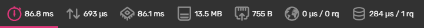<br>

### __Login__
>Formulaire de login _( affichage )_<br>
>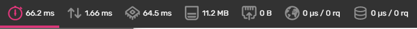<br>
>Formulaire de login _( traitement )_<br>
>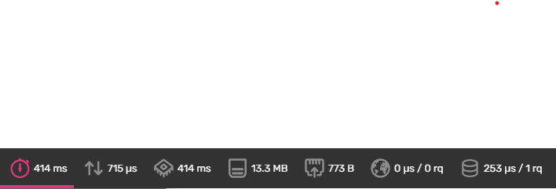<br>
>Déconexion<br>
>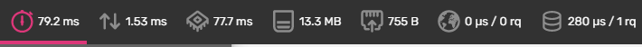<br>

### __Users__
>Formulaire de création d'un utilisateur _( affichage )_<br>
>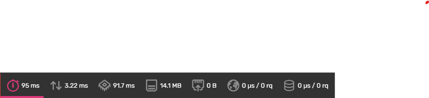<br>
>Formulaire de création d'un utilisateur _( soumission )_<br>
>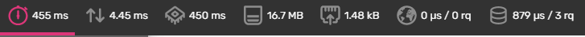<br>
>Formulaire d'édition d'un utilisateur _( affichage )_<br>
>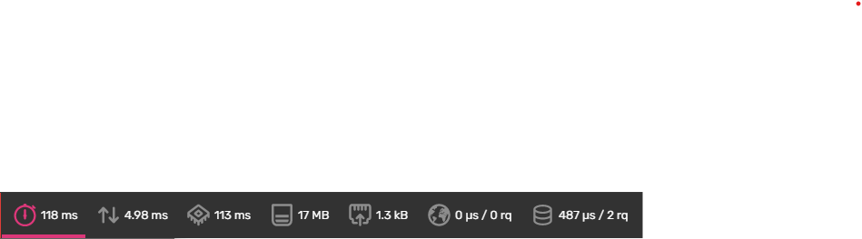<br>
>Formulaire d'édition d'un utilisateur _( soumission )_<br>
>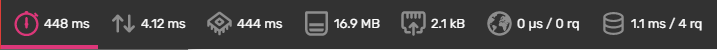<br>

### __Taches___
>Liste des tâches<br>
>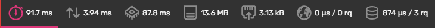<br>
>Liste des tâches à faire<br>
>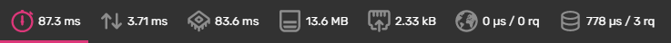<br>
>Liste des tâches terminées<br>
>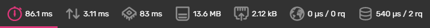<br>
>Formulaire de création de tâche _( affichage )_<br>
>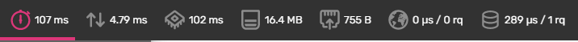<br>
>Formulaire de création de tâche _( soumission )_<br>
><br>
>Suppression d'une tâche<br>
>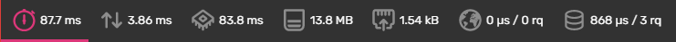<br>
>Formulaire d'édition de tâche _( affichage )_<br>
><br>
>Formulaire d'édition de tâche _( soumission )_<br>
>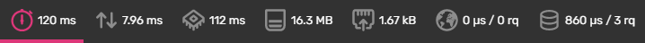<br>
>Changement de status d'une tâche _( toggle )_<br>
>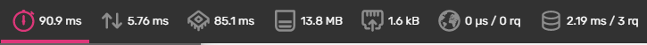<br>

<div style="page-break-after: always;"></div>

# Améliorations
## __Dockerization__
[Lien vers la pull request : Dockerize](https://github.com/LFZDavid/Todolist/pull/2/files)
modules php (xdebug, opcache)

---
## __Implémentation de tests automatisés__
[Lien vers la pull request : Test Legacy](https://github.com/LFZDavid/Todolist/pull/4/files)

---
## __Ajout de Fixtures pour les tests et le développement__
[Lien vers la pull request : Fixtures](https://github.com/LFZDavid/Todolist/pull/6/files)

---
## __Ajout agent test coverage__
[Lien vers le rapport de test coverage](https://coveralls.io/github/LFZDavid/Todolist)<br>
_nb : certaine partie du code ont été volontairement exclue du coverage. (ex: route non utilisé _login_check & logout)_

---
## Corrections des anomalies

### __Boutons de navigations__ :
>Affectation des routes sur le template `app/Resources/views/default/index.html.twig`<br>
><br>
> Création des methodes dans le controller `src/AppBundle/Controller/TaskController.php`<br>
><br>

### __Ajout du setter manquant dans la classe Task__
><br>

---
## __Upgrade__
### __Symfony__ 
> Migration vers la dernière version LTS de symfony (`4.4`).<br><br>

### __PHP__
>L'upgrade de version Symfony permet notamment d'utiliser des versions supérieurs de PHP (>=7.1.3).<br>
Il est donc recommandé d'utiliser la version `7.4` voir même la version `8` qui est également supportée.<br><br>

### __Dépendances__
>L'utilisation d'une version supérieur de PHP permet également d'utiliser de nombreux packages via composeur ainsi que des versions supérieurs de la majorités des dépendances.<br>
>Voici une liste non-exaustives des packages concernés : 
>  * sensio/framework-extra-bundle : `3.0` => `5.1`
>  * phpunit/phpunit : `5.0` => `9.5`
>  * nelmio/alice : `2.1` => `3.0`
>  * symfony/profiler : `1.0` => `4.4`
>  * symfony/security : _composant de sécurité_
>  * symfony/validator : _validation de création/édition d'entité_
>  * symfony/dotenv : _gestion de variables d'environement_
>  * symfony/form : _gestion de variables d'environement_
>  * php-coveralls : _rapport de couverture de tests_
><br>
>

### __Structure des fichiers__
>Afin de correspondre au fonctionnement de la version 4 de Symfony et en particulier `Symfony Flex`, la structure des fichiers doit être modifiée comme suis : 
```
dossier-principale/
├── assets/
├── bin/
│   └── console
├── config/
│   ├── bundles.php
│   ├── packages/
│   ├── routes.yaml
│   └── services.yaml
├── public/
│   └── index.php
├── src/
│   ├── ...
│   └── Kernel.php
├── templates/
├── tests/
├── translations/
├── var/
└── vendor/
```
## __Composant de sécurité__
>L'installation du package de sécurité permet une gestion simplifiée des accès au différentes parties de l'application.<br>
>[_plus d'information sur le composant de sécurité_](../AUTHENTICATION.md)

## __Bonnes pratiques__
* Création de class Repositories récupéré par injections de dépendances
* Utiliser la classe EntityManager au lieu de ObjectManager
* Utilisation de Listener pour l'encodage du mot de passe utilisateur
* Suppression du suffix "Action" dans les noms de methods des controller
* Utilisation de Voter pour la gestion des `Task`

## __Suggestion d'améliorations__
* Mise en place d'un cache
* Pagination
* Affichage des taches créées par utilisateur

<div style="page-break-after: always;"></div>

# Gains de performances

Gain moyen de temps : 65,6% <br>
Gain utilisation processeur 65,7%: <br>
Gain utilisation mémoire 75,5%: <br>


### __Home__
>Page d'accueil<br>
>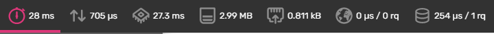<br>
>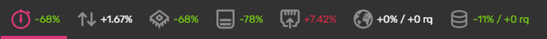<br>

### __Login__
>Formulaire de login _( affichage )_<br>
>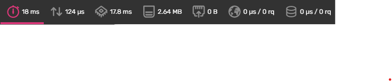<br>
>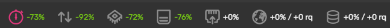<br>
>Formulaire de login _( traitement )_<br>
>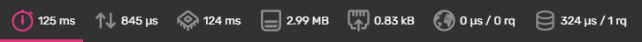<br>
>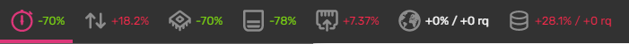<br>
>Déconexion<br>
><br>
>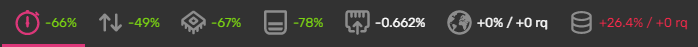<br>

### __Users__
>Formulaire de création d'un utilisateur _( affichage )_<br>
>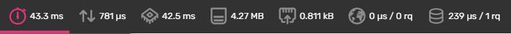<br>
>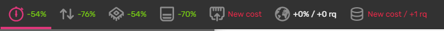<br>
>Formulaire de création d'un utilisateur _( soumission )_<br>
><br>
>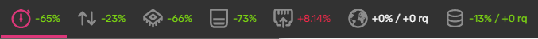<br>
>Formulaire d'édition d'un utilisateur _( affichage )_<br>
>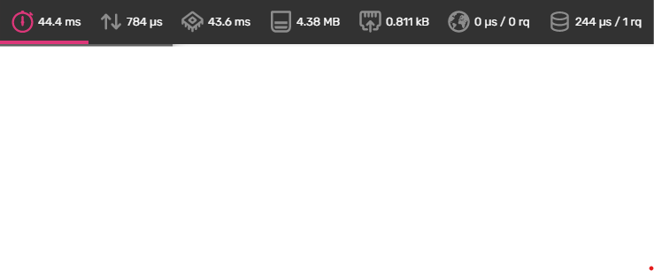<br>
>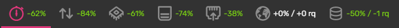<br>
>Formulaire d'édition d'un utilisateur _( soumission )_<br>
>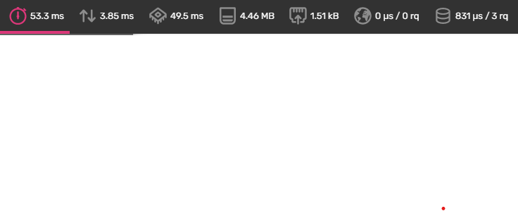<br>
>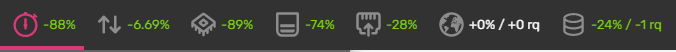<br>

### __Taches___
>Liste des tâches<br>
>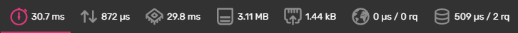<br>
>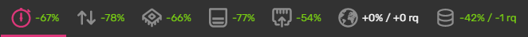<br>
>Liste des tâches à faire<br>
><br>
>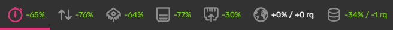<br>
>Liste des tâches terminées<br>
>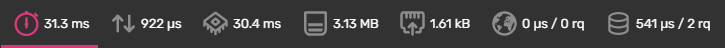<br>
>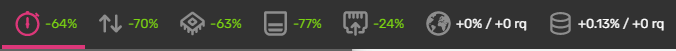<br>
>Formulaire de création de tâche _( affichage )_<br>
><br>
>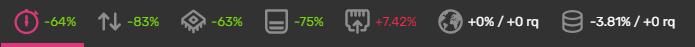<br>
>Formulaire de création de tâche _( soumission )_<br>
>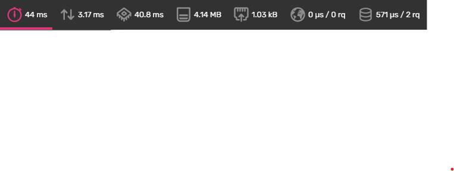<br>
>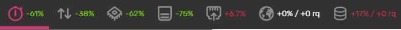<br>
>Suppression d'une tâche<br>
><br>
>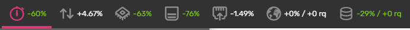<br>
>Formulaire d'édition de tâche _( affichage )_<br>
>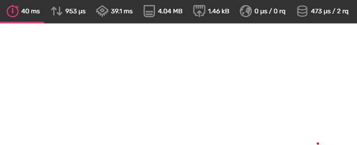<br>
>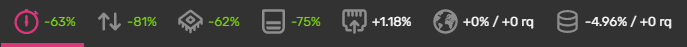<br>
>Formulaire d'édition de tâche _( soumission )_<br>
><br>
>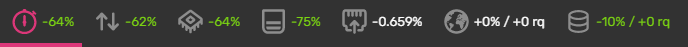<br>
>Changement de status d'une tâche _( toggle )_<br>
>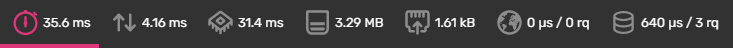<br>
>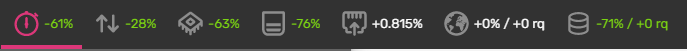<br>
