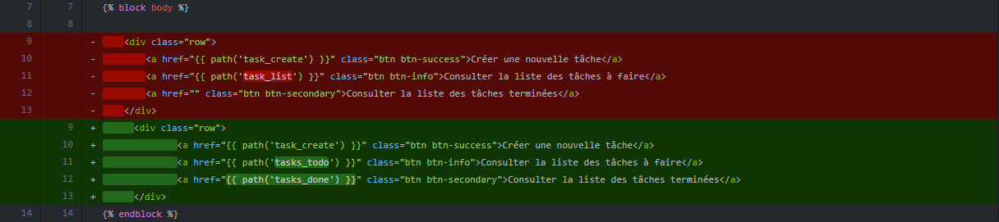
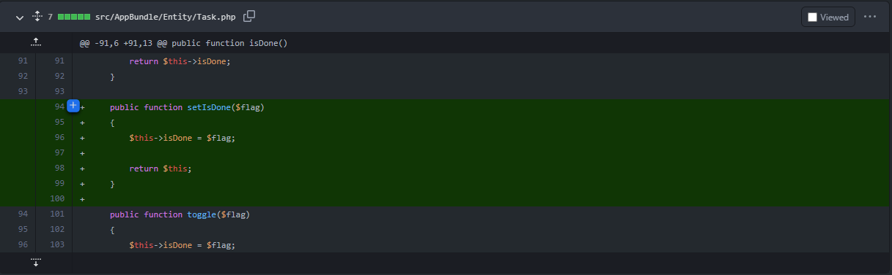

# Audit de perfomance et de qualité

## Sommaire
1. Audit technique
  * Security:Check
  * Composer Outdated
  * Analyse CodeClimate
  * Review du code
    * Assertions Entitées
    * Contraintes dans les formulaire
    * Commentaires
    * Injection de dépendances
    * Spécification des verbes HTTP pour les routes
    * Setter manquant pour l'attribut `isDone` de Task::class
    * Params non utilisé

  * Tests manuels
    * Boutons de navigation
    * Fichiers manquant (console)
  * Dette technique
    * Version Symfony
    * Version PHP

2. Audit de performance
  * Analyse des routes
  * Solution Amélioration des performances


#### Version php (<= 7.1.33)
#### Version framework (3.1)

### Améliorations
#### __Dockerize__
[Lien vers la pull request : Dockerize](https://github.com/LFZDavid/Todolist/pull/2/files)
modules php (xdebug, opcache)
#### Tests
Ajout de tests fonctionnels
[Lien vers la pull request : Test Legacy](https://github.com/LFZDavid/Todolist/pull/4/files)
#### Fixtures
Ajout de fixtures
[Lien vers la pull request : Fixtures](https://github.com/LFZDavid/Todolist/pull/6/files)

##### Mise en place d'un outils d'intégration continue
  * Installation de Travis
  * CodeClimate
  * PhpUnit
  * CoverAlls

##### Ajout agent test coverage
nb : certaine partie du code ont été volontairement exclue du coverage. (ex: route non utilisé _login_check & logout)


### Features
#### Add Author
[Lien vers la pull request : Add - Author](https://github.com/LFZDavid/Todolist/pull/10/files)

#### Add Roles
[Lien vers la pull request : Add - Roles](https://github.com/LFZDavid/Todolist/pull/11/files)
[Lien vers la pull request : Roles access](https://github.com/LFZDavid/Todolist/pull/12/files)

### Anomalies & Bonnes pratiques

#### __Boutons de navigations__ :
 ##### _Observation_ : 
  * Le bouton "Consulter la liste des tâches à faire" renvoie vers la liste de __toutes__ les taches.
  * Le bouton "Consulter la liste des taches terminées" ne renvoie nulle part.
 ##### _Amélioration_ :
  >Affectation des routes sur le template `app/Resources/views/default/index.html.twig`
  >
  
  > Création des methodes dans le controller `src/AppBundle/Controller/TaskController.php`
  >

 #### __Fichiers manquant (bootstrap/jquery)__
 ##### _Observation_ :
  Une erreur dans la console signalait des fichiers manquants
 ##### _Amélioration_ :
  Ajout des fichiers manquant pour les librairies :
  * `web/css/bootstrap.min.css.map`
  * `web/js/jquery.js`

#### Setter manquant pour l'attribut `isDone` de Task::class
>

#### Paramètre non utilisé
La methode `loginAction` de la classe `SecurityController` requière en argument `$request` ( instance de la classe `Request` ) or celui-ci n'est pas utilisé dans la methode. Il est donc préférable de le retirer.

##### Symfony
Migration vers la dernière version LTS de symfony (`4.4`).
##### PHP
L'upgrade de version Symfony permet notamment d'utiliser des versions supérieurs de PHP (>=7.1.3). Il est donc recommandé d'utiliser la version `7.4` voir même la version `8` qui est également supportée.
##### Dépendances
L'utilisation d'une version supérieur de PHP permet également d'utiliser de nombreux packages via composeur ainsi que des versions supérieurs de la majorités des dépendances.
Voici une liste non-exaustives des packages concernés : 
* sensio/framework-extra-bundle : mise à jour de la version `3.0` vers `5.1`
* phpunit/phpunit : mise à jour de la version `5.0` vers `9.5`
* nelmio/alice : mise à jour de la version `2.1` vers `3.0`
* symfony/profiler : mise à jour de la version `1.0` vers `4.4`
* symfony/security : composant de sécurité
* symfony/validator : validation de création/édition d'entité
* symfony/dotenv : gestion de variables d'environement
* symfony/form : gestion de variables d'environement
* php-coveralls : rapport de couverture de tests

##### Mise à jour de la structure des fichiers
Afin de correspondre au fonctionnement de la version 4 de Symfony et en particulier `Symfony Flex`, la structure des fichiers doit être modifiée comme suis : 
```
dossier-principale/
├── assets/
├── bin/
│   └── console
├── config/
│   ├── bundles.php
│   ├── packages/
│   ├── routes.yaml
│   └── services.yaml
├── public/
│   └── index.php
├── src/
│   ├── ...
│   └── Kernel.php
├── templates/
├── tests/
├── translations/
├── var/
└── vendor/
```
#### Bonnes pratiques
* Création de class Repositories récupéré par injections de dépendances
* Utiliser la classe EntityManager au lieu de ObjectManager
* Utilisation de Listener pour l'encodage du mot de passe utilisateur
* Suppression du suffix "Action" dans les noms de methods des controller
* Utilisation de Voter pour la gestion des `Task`
* Ajout de page d'erreurs personnalisée

#### Composant de sécurité
L'installation du package de sécurité permet une gestion simplifiée des accès au différentes parties de l'application.

##### Mise en place d'un cache
##### unicité task::title
##### minLength Entities::attr
##### Mise en place d'un cache
##### Pagination
##### Affichage des taches créées par utilisateur