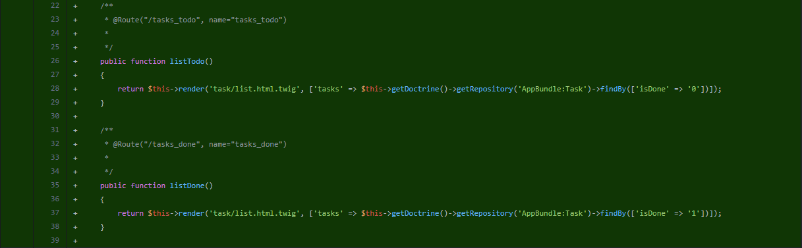

# Audit de perfomance et de qualité

## Sommaire

## Rappel du contexte
---
## Qualité du code

### Dette technique
#### Version php (<= 7.1.33)
#### Version framework (3.1)

### Améliorations
#### __Dockerize__
[Lien vers la pull request : Dockerize](https://github.com/LFZDavid/Todolist/pull/2/files)
modules php (xdebug, opcache)
#### Tests
Ajout de tests fonctionnels
[Lien vers la pull request : Test Legacy](https://github.com/LFZDavid/Todolist/pull/4/files)
#### Fixtures
Ajout de fixtures
[Lien vers la pull request : Fixtures](https://github.com/LFZDavid/Todolist/pull/6/files)

##### Mise en place d'un outils d'intégration continue
  * Installation de Travis
  * CodeClimate
  * PhpUnit
  * CoverAlls

##### Ajout agent test coverage
nb : certaine partie du code ont été volontairement exclue du coverage. (ex: route non utilisé _login_check & logout)

### Features
#### Add Author
[Lien vers la pull request : Add - Author](https://github.com/LFZDavid/Todolist/pull/10/files)

#### Add Roles
[Lien vers la pull request : Add - Roles](https://github.com/LFZDavid/Todolist/pull/11/files)
[Lien vers la pull request : Roles access](https://github.com/LFZDavid/Todolist/pull/12/files)

### Anomalies & Bonnes pratiques

#### __Boutons de navigations__ :
 ##### _Observation_ : 
  * Le bouton "Consulter la liste des tâches à faire" renvoie vers la liste de __toutes__ les taches.
  * Le bouton "Consulter la liste des taches terminées" ne renvoie nulle part.
 ##### _Amélioration_ :
  >Affectation des routes sur le template `app/Resources/views/default/index.html.twig`
  >
  
  > Création des methodes dans le controller `src/AppBundle/Controller/TaskController.php`
  >

 #### __Fichiers manquant (bootstrap/jquery)__
 ##### _Observation_ :
  Une erreur dans la console signalait des fichiers manquants
 ##### _Amélioration_ :
  Ajout des fichiers manquant pour les librairies :
  * `web/css/bootstrap.min.css.map`
  * `web/js/jquery.js`

#### Setter manquant pour l'attribut `isDone` de Task::class
>
#### __Pages d'erreurs__

### Résultat
---
## Performance
### Outils utilisés
##### Blackfire
### Mesures
### Mise en oeuvre
### Résultat
### Suggestions d'améliorations
##### unicité task::title
##### minLength Entities::attr
##### Mise en place d'un cache
##### Pagination
##### Affichage des taches créées par utilisateur