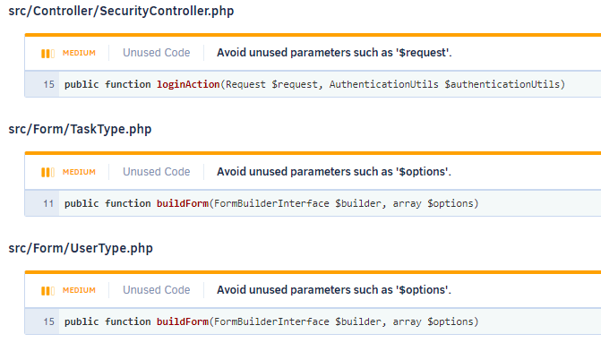

# TodoList : Audit de perfomance et de qualité
---


<p style="margin-top: 50%;">
Auteur : <strong>David Cornacchia</strong><br>
Dernière mise à jour : <strong>15/11/2021</strong>
</p>

<div style="page-break-after: always;"></div>

# Sommaire
---
1. [Audit technique](#audit-technique)
   1.1 [Dette technique](#__dette-technique__) 
    - [Obsolèscence des packages](#__dette-technique__) 
    - [Version du Framework](#__dette-technique__)
    - [Version PHP](#__dette-technique__)

   1.2 [Analyse automatique](#analyse-automatique)
   1.3 [Review manuelle](#analyse-automatique)
    - [Anomalies](#analyse-automatique)
    - [Points améliorables](#analyse-automatique)
2. [Audit de performances](#audit-de-performances)
   2.1 [Analyse des routes](#__analyse-des-routes__)
   2.2 [Améliorations](#améliorations)
  
    - [Dockerization](#améliorations)
    - [Fixtures](#améliorations)
    - [Tests automatisés](#améliorations)
    - [Test coverage](#améliorations)
    - [Corrections des anomalies](#améliorations)
    - [Uprade](#__upgrade__)
    - [Composant de sécurité](#__composant-de-sécurité__)
3. [Gains de performances](#gains-de-performances)
   3.1 [Analyse des routes](#gains-de-performances)
4. [Suggestions d'améliorations](#__suggestion-daméliorations__)

<div style="page-break-after: always;"></div>

# Audit technique
---
## __Dette technique__
### __Obsolèscence des packages__ <br>
La commande `composer outdated` nous permet d'afficher la liste des paquets installés ayant des mises à jour disponibles.<br>
<br>

<div style="page-break-after: always;"></div>

### __Version du Framework__<br>
>La version Symfony utilisée est la __3.1__
>Comme indiqué dans la documentation cette version n'est plus maintenue depuis 2017. <br>
><br>
_source : [calendrier de release Symfony](https://symfony.com/releases)_

---
### __Version php__<br>
La version haute utilisable est la 7.1.33
C'est sur cette version qu'a été fait cet audit.<br>
><br>
>_source : [doc officielle php](https://www.php.net/eol.php)_

<div style="page-break-after: always;"></div>

## Analyse automatique
>L'analyse de qualité du code faite grace à l'outils [CodeClimate](https://codeclimate.com/) n'a révélé que quelques anomalies non critiques, qui pourront être corrigées facilement.<br>
><br>

---
## Review manuelle
### Anomalies
* Le bouton "_Consulter la liste des tâches à faire_" renvoie vers la liste de __toutes__ les taches.

* Le bouton "_Consulter la liste des taches terminées_" ne renvoie nulle part.

* Setter manquant pour l'attribut `isDone` de Task::class

* Fichiers manquant (bootstrap/jquery)
  Une erreur dans la console signalait des fichiers manquants
   * `web/js/jquery.js`
   * `web/css/bootstrap.min.css.map`


### Points améliorables
* Ajouter des contraintes de validation sur les entitées et ou les formulaires _( [voir doc Validation](https://symfony.com/doc/current/validation.html) )_

* Personnalisation des pages d'erreurs _(500, 404, etc...)_ 
* Utiliser l'injection de dépendances plutôt que les containers
* Spécification des verbes HTTP pour les routes

<!-- ### Features
### Add Author
[Lien vers la pull request : Add - Author](https://github.com/LFZDavid/Todolist/pull/10/files)

### Add Roles
[Lien vers la pull request : Add - Roles](https://github.com/LFZDavid/Todolist/pull/11/files)
[Lien vers la pull request : Roles access](https://github.com/LFZDavid/Todolist/pull/12/files) -->

<div style="page-break-after: always;"></div>

# Audit de performances
---
## __Analyse des routes__

L'analyse des performances de l'application a été effectuée avec l'outils [Blackfire](https://blackfire.io/).
Parmis les données récoltés

|Route|Temps d'execution|Memoire utilisée _(MB)_|
|---|---|---|
|__Home__|
|Page d'accueil|86.8 _ms_|13.5 _MB_|
||
|__Login__|
|Login _( formulaire )_|66.2 _ms_|11.2 _MB_|
|Login _( process )_|66.2 _ms_|13.3 _MB_|
|Déconexion|79.2 _ms_|13.3 _MB_|
||
|__Users__|
|Création d'un utilisateur _( formulaire )_|95 _ms_|14.1 _MB_|
|Création d'un utilisateur _( process )_|455 _ms_|16.7 _MB_|
|Edition d'un utilisateur _( formulaire )_|118 _ms_|17 _MB_|
|Edition d'un utilisateur _( process )_|448 _ms_|16.9 _MB_|
||
|__Users__|
|Liste des tâches _(toutes)_|86.1 _ms_|13.6 _MB_|
|Liste des tâches _(a faire)_|87.3 _ms_|13.6 _MB_|
|Liste des tâches _(terminées)_|86.1 _ms_|13.6 _MB_|
||
|__Tasks__|
|Création d'une tâche _( formulaire )_|107 _ms_|16.4 _MB_|
|Création d'une tâche _( process )_|112 _ms_|16.3 _MB_|
|Edition d'une tâche _( formulaire )_|109 _ms_|16.5 _MB_|
|Edition d'une tâche _( process )_|120 _ms_|16.3 _MB_|
|Changement de status d'une tâche _( toggle )_|90.9 _ms_|13.8 _MB_|
|Suppression d'une tâche|87.7 _ms_|13.8 _MB_|

<div style="page-break-after: always;"></div>

# Améliorations
---
## __Dockerization__
L'intégration de Docker permet de facilement et rapidement configurer un environement complet qui pourra être installé sur nimporte quel machine. Celà permet entre autres, de fournir à tous les développeurs travaillant sur le même projet, un environement identique (version et extensions php, version mysql, services annexes,etc...).

[Lien vers la pull request : Dockerize](https://github.com/LFZDavid/Todolist/pull/2/files)
modules php (xdebug, opcache)

---
## __Implémentation de tests automatisés__
Les tests unitaires et fonctionnels permettent de s'assurer du fonctionnement des différents éléments de l'application. Les tests pouvant être lancés à tout moments ils permettent par exemple, pendant la phase de développement d'une nouvelle fonctionnalitée, de s'assurer que l'implémentation ne provoque pas d'effets de bords sur le reste de l'application.

[Lien vers la pull request : Test Legacy](https://github.com/LFZDavid/Todolist/pull/4/files)

---
## __Ajout de Fixtures pour les tests et le développement__
La création de fixtures _( ou jeu de données )_ offre la possibilité de simuler le comportement de l'application en phase d'exploitation. Il facilite le développement et les tests des features qui seront chargés d'interagir avec la base de données.

[Lien vers la pull request : Fixtures](https://github.com/LFZDavid/Todolist/pull/6/files)

---
## __Ajout agent test coverage__
L'analyse de la couverture de tests permet de s'assurer du taux de couverture des tests automatisés. Une bonne couverture garantie la détection des éventuels disfonctionnement de l'application. 

[Lien vers le rapport de test coverage](https://coveralls.io/github/LFZDavid/Todolist)<br>
_nb_: _certaine partie du code ont été volontairement exclue du coverage._ (ex: route non utilisé _login_check & logout)

<div style="page-break-after: always;"></div>

## __Corrections des anomalies__
* Boutons de navigations : 
  * fix: des liens défectueux
  * fix: des routes manquantes
* Ajout de la méthode Task::isDone()
* Ajout des fichiers manquant :
 * `web/js/jquery.js`
 * `web/css/bootstrap.min.css.map`

<div style="page-break-after: always;"></div>

## __Upgrade__
### __Symfony__ 
Migration vers la dernière version LTS de symfony.<br>
Le passage à une version supérieur du framework serait l'une des principale solution pour améliorer l'application. Néammoins, le choix de la version sur laquelle migrer est primordiale.
Le [calendrier de release Symfony](https://symfony.com/releases) indique qu'en moyenne une version LTS _(Long-term support)_ sort tous les 2 ans. 
Par définition, ces versions sont celle bénéficiant de la période de maintenance la plus longue _(~3ans pour les bugs et ~3,5ans pour la sécurité)_ .
A l'heure ou cet audit est effecuté la version LTS la plus récente est la version `4.4`.  


### __PHP__
L'upgrade de version Symfony permet notamment d'utiliser des versions supérieurs de PHP.<br>
Il est donc recommandé d'utiliser la version `7.4`.<br>
Comme indiqué dans [la documentation officielle PHP](https://www.php.net/releases/7_4_0.php), le language a fait l'objet de nombreuses évolutions, ainsi que l'ajout de différentes [fonctionnalitées](https://www.php.net/manual/fr/migration74.new-features.php) _(propriétés typées, fonctions flèches, déballage dans les tableaux, etc...)_.

C'est donc cette version qui été utilisé pour le profiling de la branch `develop` du projet qui contient les améliorations de l'application.<br>

<div style="page-break-after: always;"></div>

### __Dépendances__
L'utilisation de la version `4.4` de PHP permet également d'utiliser de nombreux packages via composeur ainsi que des versions supérieurs de la majorités des dépendances.<br>
Voici une liste non-exaustives des packages concernés : 
>  * sensio/framework-extra-bundle : `3.0` => `5.1`
>  * phpunit/phpunit : `5.0` => `9.5`
>  * nelmio/alice : `2.1` => `3.0`
>  * symfony/profiler : `1.0` => `4.4`
>  * symfony/security : _composant de sécurité_
>  * symfony/validator : _validation de création/édition d'entité_
>  * symfony/dotenv : _gestion de variables d'environement_
>  * symfony/form : _gestion de variables d'environement_
>  * php-coveralls : _rapport de couverture de tests_
><br>
>

### __Structure des fichiers__
Afin de correspondre au fonctionnement de la version 4 de Symfony et en particulier `Symfony Flex`, la structure des fichiers doit être modifiée comme suis : 
```
dossier-principale/
├── assets/
├── bin/
│   └── console
├── config/
│   ├── bundles.php
│   ├── packages/
│   ├── routes.yaml
│   └── services.yaml
├── public/
│   └── index.php
├── src/
│   ├── ...
│   └── Kernel.php
├── templates/
├── tests/
├── translations/
├── var/
└── vendor/
```
<div style="page-break-after: always;"></div>

## __Composant de sécurité__
L'installation du package de sécurité permet une gestion simplifiée des accès au différentes parties de l'application.<br>
_plus d'information sur le composant de sécurité_ _[ici](../AUTHENTICATION.md)_

## __Bonnes pratiques__
* Création de class __Repositories__ récupéré par injections de dépendances.
* Utiliser la classe __EntityManager__ au lieu de ObjectManager.
* Utilisation de __Listener__ pour l'encodage du mot de passe utilisateur.
* Suppression du suffix "_Action_" dans les noms de methods des controller.
* Utilisation de __Voter__ pour la gestion des accès au différentes action.effectuable sur les entités.
* Utilisation des déclarations de type (type-hint). 

<div style="page-break-after: always;"></div>

# Gains de performances
---
En comparant les performance de la branche principale avec la branche `develop` qui contient toutes les améliorations présentées ci-dessus, on constate une nette amélioration des performances. 

|Gain moyen|%|
|---|---|
|Temps d'execution | 65,6%|
|Utilisation mémoire | 75,5%|

|Route|Temps d'execution|Memoire utilisée _(MB)_|
|---|---|---|
|__Home__|
|Page d'accueil|28 _ms_ __(-68%)__|2.99 _MB_ __(-78%)__|
||
|__Login__|
|Login _( formulaire )_|18 _ms_ __(-76%)__|2.64 _MB_ __(-73%)__|
|Login _( process )_|125 _ms_ __(-78%)__|2.99 _MB_ __(-70%)__|
|Déconexion|26.5 _ms_ __(-78%)__|2.88 _MB_ __(-66%)__|
||
|__Users__|
|Création d'un utilisateur _( formulaire )_|43.3 _ms_ __(-70%)__|4.27 _MB_ __(-54%)__|
|Création d'un utilisateur _( process )_|157 _ms_ __(-73%)__|4.43 _MB_ __(-65%)__|
|Edition d'un utilisateur _( formulaire )_|44.4 _ms_ __(-74%)__|4.38 _MB_ __(-62%)__|
|Edition d'un utilisateur _( process )_|53.3 _ms_ __(-74%)__|4.46 _MB_ __(-88%)__|
||
|__Tasks__|
|Liste des tâches _(toutes)_|30.7 _ms_ __(-77%)__|3.11 _MB_ __(-67%)__|
|Liste des tâches _(a faire)_|30.6 _ms_ __(-77%)__|3.13 _MB_ __(-65%)__|
|Liste des tâches _(terminées)_|31.3 _ms_ __(-77%)__|3.13 _MB_ __(-64%)__|
|Création d'une tâche _( formulaire )_|38.6 _ms_ __(-75%)__|4.03 _MB_ __(-64%)__|
|Création d'une tâche _( process )_|44 _ms_ __(-75%)__|4.14 _MB_ __(-61%)__|
|Edition d'une tâche _( formulaire )_|40 _ms_ __(-75%)__|4.04 _MB_ __(-63%)__|
|Edition d'une tâche _( process )_|43.5 _ms_ __(-75%)__|4.13 _MB_ __(-64%)__|
|Changement de status d'une tâche _( toggle )_|35.6 _ms_ __(-76%)__ |3.29 _MB_ __(-61%)__|
|Suppression d'une tâche|35.3 _ms_ __(-76%)__|3.38 _MB_ __(-60%)__|

<div style="page-break-after: always;"></div>

# __Suggestion d'améliorations__
---
### Cache
  La mise en place de mise en cache sur certaines pages permettrait de réduire d'avantage le chargement.
### Pagination
  Dans l'hypothèse ou le nombre de taches et d'utilisateurs atteindrait un nombre important un syteme de pagination permettrait d'améliorer le confort de navigation et également de limiter le chargement d'éléments sur les pages destinées à afficher une liste de ces entités.
### Navigation a facettes
  La navigation a facettes permettrait de filter l'affichage des taches de manière intuitive (ex: période de création, autheur, etc...).

### Migration version php 8
  La version 8 de PHP est relativement récente à l'heure actuelle mais il serait très probablement bénéfique, à terme, de migrer vers cette version afin de bénéficier de nouvelles fonctionnalitées et évolutions liées au languages (ex : Attributs, Types d'union, etc... ).
